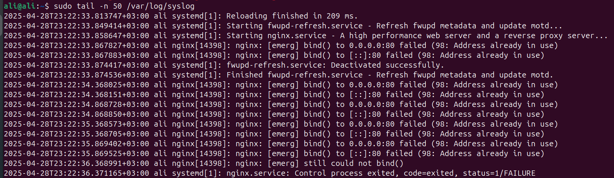

## Before we start let’s assume:

- **Internal DNS IP:** 192.168.0.100
- **Host IP:** 192.168.0.10
- **Web-Server:** Nginx
- **DNS Server:** BIND 9
- **OS:** Ubuntu Server

## 1. Verify DNS Resolution

### a) Check current resolver (`/etc/resolv.conf`)

```bash
cat /etc/resolv.conf
dig internal.example.com
```

### b) Compare against Google's DNS (8.8.8.8)

```bash
dig internal.example.c@8.8.8.8
```

---

## 2. Diagnose Service Reachability

### a) Check if the service is reachable on the resolved IP

```bash
ping 192.168.0.10
```

Check if web service (port 80/443) is reachable using `telnet` :

```bash
telnet 192.168.0.10 80
# or
telnet 192.168.0.10 443
```

### b) Check if the service is listening locally

```bash
sudo ss -tuln | grep ':80\|:443'
```

---

## 3. Trace the Issue – List All Possible Causes

### DNS Related issue:

- Missing DNS entry
- DNS server is down
- Wrong DNS in the `/etc/resolv.conf` file

### Network Related issue:

- No Connectivity to the host server
- Denied Inbound traffic to the host server
- Denied Inbound protocols to the host server

### Web Server related issue:

- web service not running
- Incorrect file paths
- Issue in SSL certificates

### Other Cloud Possible Issues (AWS):

- Load balancer health check fails
- Miss-configuration of the EC2 instances created
- Denied inbound traffic in the security group or NACLs of instance or the subnet itself

---

## 4. Propose and Apply Fixes

### 🧩 Checking System Logs

### Before we dive into the causes above, we must first check for different log files to help us save time digging into other scenarios

- Check `/var/log/syslog` for DNS errors
- Check `/var/log/nginx/error.log` or `/var/log/nginx/access.log`  for web server requests
- Check `/var/log/audit/audit.log` for security policies related to SELinux

  
<p align="center">
  
</p>

---

### 🧩 DNS Related Problems

**Potential Cause:** Incorrect DNS settings or missing DNS entry.

**How to Confirm:**

```bash
dig internal.example.com
dig internal.example.com @192.168.0.100
```


**Fix Commands:**

- If `/etc/resolv.conf` has wrong nameserver:

```bash
sudo nano /etc/resolv.conf
```

- If missing DNS record, add record on DNS server.


---

### 🧩 Internal DNS Server Down

**How to Confirm:**

```bash
dig @192.168.0.100 internal.example.com
```

If timeout or failure occurs, DNS server might be down.

**Fix Commands:**

- Restart internal DNS server:

```bash
sudo systemctl restart bind9
```

---

### 🧩 Network Issues

**Potential Cause:** Network/firewall issues.

**How to Confirm:**

```bash
ping 192.168.0.10
traceroute 192.168.0.10
```


If unreachable, inspect firewall rules or network settings.

**Fix Commands:**

- Allow HTTP/HTTPS in firewall:

```bash
sudo ufw allow 80/tcp
#AND
sudo ufw allow 443/tcp
```


---

### 🧩 Service Not Running

**How to Confirm:**

```bash
sudo systemctl status nginx
```


**Fix Commands:**

- Start or restart service:

```bash
sudo systemctl restart nginx
```

---

## 🏆 Bonus

### a) Configure `/etc/hosts` to bypass DNS

Edit `/etc/hosts`:

```bash
sudo nano /etc/hosts
```

Add:

```
192.168.0.10   internal.example.com
```

Test:

```bash
ping internal.example.com
curl http://internal.example.com
```

---

### b) Persist DNS Settings with systemd-resolved

**Method:**

```bash
sudo nano /etc/systemd/resolved.conf
```

Set:

```
[Resolve]
DNS=192.168.0.100
Domains=example.com
```

Then:

```bash
sudo systemctl restart systemd-resolved
```

**Verify:**

```bash

systemd-resolve --status
```
